# Fabulari — Phase 2 Documentation

**Student Name:** Anthony Quizon
**Student Number:** S5353244
**Workshop Time:** [your workshop time]
**Course:** 3813ICT — Full Stack Development
**GitHub Repository:** https://github.com/applepies16m-gif/38

---

## 1. Overview

Fabulari is a real-time chat application built on the MEAN stack: MongoDB, Express, Angular and Node.js, with Socket.io for live messaging. Users talk in channels that belong to groups. There are three permission levels:

- **User**: asks to join groups, chats in the groups they belong to, and manages their own profile.
- **Group Admin**: runs one or more groups. Approves join requests, manages members and channels, and edits the group's settings.
- **Super Admin**: runs the system. Approves new groups, bans users from the whole system, decides reports, sends announcements and reads the audit log. The Super Admin does not take part in chat.

Phase 1 delivered a user interface with users and groups saved in JSON files. Phase 2 is the working application: all data is in MongoDB, chat is live over sockets, images can be sent, passwords are hashed, and the rules are enforced on the server as well as in the browser.

The application code is in `angle/my-app` (Angular) and `angle/my-app/server` (Node).

---

## 2. Running the Application

**You need:** Node.js 20 or later, and MongoDB running locally on its default port (27017).

**Install once**, from `angle/my-app`:

```
npm install
cd server
npm install
```

**Start three things, each in its own terminal:**

| # | Where | Command | What it is |
|---|---|---|---|
| 1 | anywhere | `mongod` | The database, on port 27017 |
| 2 | `angle/my-app/server` | `node server.js` | The server, on http://localhost:3000 |
| 3 | `angle/my-app` | `ng serve` | The Angular app, on http://localhost:4200 |

Open http://localhost:4200. On an empty database the app shows a first-time setup screen that creates the Super Admin.

**Demo data (optional).** From `angle/my-app/server`:

```
node seed.js --yes --password=ChooseOne1
```

This empties the database (after writing a backup to `server/backups`) and creates five accounts that all use the password you gave: `super` (Super Admin), `groupadmin` and `groupadmin2` (Group Admins), `member` and `newuser`. It also creates two groups, "Study Group" and "Gaming Lounge" (18+). Adding `--large` creates 150 more users, 40 more groups and 120 audit entries, to show search and paging on long lists. No password is written in the script; the one you give is hashed before it is stored.

---

## 3. Git Strategy

The repository is hosted on GitHub with the teaching team as a collaborator.

- **One branch, `main`,** always holding a version that builds and runs.
- **One commit per feature,** made when that feature works, so the history reads as a list of what was added. Examples: `image messages: upload JPEG, PNG or GIF up to 2 MB...`, `join requests: server refuses banned users, existing members...`.
- **Commit messages** say what changed in plain words, in the present tense.
- **Files are staged by name,** so unrelated files in the working folder are never committed.
- **Generated or private files are ignored:** `node_modules`, uploaded images (`server/uploads`), database backups (`server/backups`) and test output.

Phase 1 planned a branch per feature. In practice the work was done by one person in sequence, so committing each finished feature directly to `main` gave the same readable history without the merge steps.

---

## 4. Requirements

### 4.1 Functional requirements

The numbering follows the Phase 1 document.

| # | Requirement | Status | Where it is implemented |
|---|---|---|---|
| 1 | Log in with a username and password | Done | `POST /api/login`, Login page |
| 2 | Three permission levels, each with its own interface | Done | Chat (user), Group Admin page, Admin Panel; each page checks the role when it opens |
| 3 | Users, groups and channels stored persistently | Done | MongoDB collections `users`, `groups`, `channels` |
| 4 | A new user has no groups and sees the list of groups | Done | Chat shows "not in any groups yet"; Browse Groups lists every group |
| 5 | Joining is by request, which a Group Admin approves or rejects with a reason | Done | `/api/join-requests`; Browse Groups; Group Admin page |
| 6 | A user can request a new group; on approval they become its admin | Done | `/api/group-requests`; Group Request page; Admin Panel |
| 7 | Every group always has at least one admin; the last admin cannot delete their account | Done | Enforced in `POST /api/groups`, `PUT /api/groups/:id`, `DELETE /api/users/:id` and ban-request approval |
| 8 | A user can be an admin of several groups | Done | `groups.adminIds`; the Group Admin page has a group switcher |
| 9 | Group Admins create and remove channels | Done | `POST` and `DELETE /api/channels`; Group Admin page. Channel requests from ordinary members were dropped: admins create channels directly |
| 10 | "X has joined/left the room" notices, seen only by that channel | Done | Socket events `userJoined`, `userLeft` |
| 11 | Only the last 5 messages of a channel are stored and shown | Done | `sendMessage` prunes to 5; `GET /api/messages` |
| 12 | Messages can be text or images (JPEG, PNG, GIF) | Done | `POST /api/upload`; chat composer |
| 13 | Images are limited to 2 MB | Done | Checked in the browser and by the server |
| 14 | Users can delete their own messages, not edit them | Done | Socket event `deleteMessage`; there is no edit event |
| 15 | Online/offline indicator per user | Done | Real presence counted from socket connections; "Online Now" panel |
| 16 | Group Admins ban from a group; the Super Admin bans from the system | Done | Enforced by the server at login, when joining a channel, when sending, and on join requests |
| 17 | A Group Admin can only be removed or banned at another Group Admin's request, reviewed by the Super Admin | Done | `/api/ban-requests` with `reviewer: 'super_admin'`; a direct ban of an admin is refused |
| 18 | A user can ask their Group Admin to remove or ban a member, with a reason | Done | "ask to remove" and "ask to ban" in Online Now; Group Admin page |
| 19 | Admin actions are recorded in an audit log the Super Admin can read | Done | `auditLog` collection; Audit Log page with filters |
| 20 | The Super Admin does not chat and cannot read chat history | Done | The Super Admin is redirected away from Chat; `GET /api/messages` returns nothing to a non-member |
| 21 | Group title (max 30), description (max 250), optional age limit | Done | Validated by the server (`checkGroupFields`) and limited in the forms |
| 22 | A user under a group's age limit is told and cannot join | Done | `checkJoinAllowed`, from the date of birth, checked on request and again on approval |
| 23 | Private profile: name, username, email (locked), password, optional picture | Done | Profile page; picture uploaded and saved on the account |
| 24 | Other users cannot see someone's profile page | Done | The Profile page only ever shows the logged-in user |
| 25 | Users can change username and password (old password checked), not email | Done | Profile page; `PUT /api/users/:id` does not accept `email` |
| 26 | Passwords: at least 8 characters with an uppercase letter | Done | Checked in the forms and by the server |
| 27 | Passwords are hashed before storage | Done | bcrypt (`server/passwords.js`); never returned by any route |
| 28 | A bootstrap process creates the first Super Admin, then disables itself | Done | `POST /api/bootstrap` answers 403 once any user exists |
| 29 | The Super Admin can send one-way notifications | Done | `/api/notifications`; Notifications page; live unread count |
| 30 | A group's chat background can be customised by its admin | Done | `groups.theme`; colour picker on the Group Admin page |
| 31 | User blocking and reporting | Done, as interpreted (see the note below) | Blocks saved on the blocker's account; reports decided by the Super Admin; remove and ban requests decided by Group Admins |

**Note on requirement 31.** The client's wording was "User-blocking reporting is a necessary feature", which can be read more than one way. It was implemented to cover each reading:

- **Reporting a user.** A member reports another user with a reason. The Super Admin decides each report, and the group's admins can read the reports for their group.
- **Asking for a user to be blocked from a group.** A member asks the group's admins to remove or ban someone, with a reason (requirement 18).
- **Blocking a user personally.** A member hides another user's messages and notices for themself only. This reading was an interpretation and was not stated by the client.

**Added beyond the list:** each user can choose their own size and colour for the whole site (Profile, Appearance); long lists are searchable and paged; the interface is usable by keyboard and screen reader.

### 4.2 Scope assumptions

The Phase 1 assumptions still hold: no content moderation, no OAuth, no clickable links in messages, no replies to a specific message, no push notifications, one language, tablet and desktop widths only.

**HTTPS** was listed for the final submission. The application currently runs over HTTP on `localhost`. See section 12.

---

## 5. Data Structures

All data is in the MongoDB database `fabulari`, accessed with the official `mongodb` driver. Every document has MongoDB's own `_id`; the server sends it to the browser as a text field named `id`.

### users

| Field | Type | Notes |
|---|---|---|
| `username` | text | Stored in lower case; unique |
| `password` | text | A bcrypt hash. Never sent to the browser |
| `firstName`, `lastName` | text | Collected at registration and first-time setup |
| `displayName` | text | Shown to other users; defaults to "First Last" |
| `bio` | text, optional | "About Me" text from the profile page, up to 500 characters |
| `email` | text | Cannot be changed after registration |
| `dateOfBirth` | text, optional | `YYYY-MM-DD`. Can be set once. Used for group age limits |
| `role` | text | `super_admin`, `group_admin` or `user` |
| `groupIds` | list of text | The groups the user belongs to |
| `bannedFromGroupIds` | list of text | Groups the user is banned from |
| `isSystemBanned` | true/false | Banned from the whole system |
| `profilePicUrl` | text, optional | A path such as `/uploads/3f9a….png` |
| `blockedUserIds` | list of text, optional | Users whose messages this user has hidden |
| `notificationsReadAt` | text, optional | When the user last opened their notifications |
| `appearance` | object, optional | `{ textScale, hue }`: the user's chosen size and colour |

`online` is not stored: the server works it out from live socket connections each time it sends a user.

### groups and channels

| Collection | Field | Type | Notes |
|---|---|---|---|
| `groups` | `title` | text | Up to 30 characters |
| | `description` | text | Up to 250 characters |
| | `ageLimit` | whole number | 0 means no limit |
| | `adminIds` | list of text | Never empty |
| | `theme` | text, optional | A colour such as `#dbeafe`, or empty |
| | `channelIds` | list | Kept from Phase 1 and not used; channels name their group instead |
| `channels` | `name` | text | Up to 30 characters |
| | `groupId` | text | The group the channel belongs to |

### messages

| Field | Type | Notes |
|---|---|---|
| `channelId` | text | |
| `senderId` | text | Set by the server from the socket, not taken from the browser |
| `senderName` | text | |
| `text` | text | May be empty if there is an image |
| `imageUrl` | text, optional | A path the upload endpoint handed out |
| `timestamp` | text | ISO date and time |

Only the 5 newest messages of each channel are kept.

### Requests, reports, notifications and the audit log

| Collection | Fields | Purpose |
|---|---|---|
| `joinRequests` | `userId`, `groupId`, `status`, `rejectionReason` | A user asking to join a group |
| `groupRequests` | `requestedBy`, `proposedTitle`, `proposedDescription`, `proposedAgeLimit`, `status`, `rejectionReason` | A user asking for a new group |
| `banRequests` | `requestedBy`, `targetUserId`, `groupId`, `action` (`remove` or `ban`), `reason`, `reviewer` (`group_admin` or `super_admin`), `status`, `rejectionReason`, `createdAt` | Asking for someone to be removed or banned from a group |
| `reports` | `reporterId`, `reportedUserId`, `groupId`, `reason`, `messageText`, `status` (`open`, `resolved`, `dismissed`), `decisionNote`, `createdAt`, `decidedAt` | One user reporting another |
| `notifications` | `message`, `recipientId` (empty means everyone), `sentBy`, `createdAt` | Announcements from the Super Admin |
| `auditLog` | `type`, `summary`, `actorId`, `actorName`, `actorRole`, `createdAt` | One line per admin action |

`status` on a request is `pending`, `approved` or `rejected`. A `roomRequests` collection and its routes remain from an earlier design; nothing in the application uses them.

---

## 6. Angular Architecture

The app uses standalone components (no NgModules), runs without Zone.js, and is written in TypeScript. Each component lives in `src/app/components/<name>/` as a `.ts`, `.html` and `.css` file.

### Components and routes

| Route | Component | Who | Purpose |
|---|---|---|---|
| `/login` | `LoginComponent` | everyone | Log in. Sends an empty system to first-time setup |
| `/bootstrap` | `BootstrapComponent` | first run only | Creates the first Super Admin |
| `/register` | `RegisterComponent` | everyone | Create an account |
| `/chat` | `ChatShellComponent` | users, Group Admins | Channels, the conversation, who is online |
| `/browse-groups` | `BrowseGroupsComponent` | users, Group Admins | Find groups and ask to join |
| `/group-request` | `GroupRequestComponent` | users, Group Admins | Ask for a new group |
| `/notifications` | `NotificationsComponent` | users, Group Admins | Read announcements |
| `/profile` | `ProfileComponent` | users, Group Admins | Own details, picture, password, appearance, blocked users |
| `/group-admin` | `GroupAdminComponent` | Group Admins | Manage a group |
| `/admin` | `AdminPanelComponent` | Super Admin | Manage the system |
| `/audit-log` | `AuditLogComponent` | Super Admin | Read the audit log |

**Route protection.** Each protected component checks the logged-in user in `ngOnInit` and redirects if the role is wrong. These checks decide what a person sees; the rules themselves are enforced by the server (section 9).

### Services

| Service | Responsibility |
|---|---|
| `AuthService` | Remembers the logged-in user in `localStorage` (never the password); applies their appearance; tells the server which user a browser tab belongs to |
| `UserService` | Users: login, register, update, delete, block and unblock |
| `GroupService` | Groups, and join, group and ban requests |
| `ChannelService` | List, create and delete channels |
| `MessageService` | The last 5 messages of a channel |
| `SocketService` | The one Socket.io connection shared by the app |
| `UploadService` | Checks an image and uploads it |
| `ReportService` | Reports |
| `NotificationService` | Notifications and the audit log |
| `AppearanceService` | Turns a user's size and colour into CSS variables on the page |

### Models, utilities and the interceptor

| File | Contents |
|---|---|
| `models/user.model.ts` | `User` |
| `models/group.model.ts` | `Group`, `Channel`, `JoinRequest`, `GroupCreationRequest`, `BanRequest`, `RoomRequest` |
| `models/message.model.ts` | `ChatMessage`, `SystemMessage` (a joined/left notice) |
| `models/report.model.ts` | `Report` |
| `models/notification.model.ts` | `AppNotification`, `AuditEntry` |
| `utils/date-of-birth.ts` | `calculateAge`: the same age rule the server applies |
| `utils/paged-list.ts` | `PagedList<T>`: a searchable list shown a page at a time |
| `interceptors/actor.interceptor.ts` | Adds the logged-in user's id to every request as an `X-User-Id` header |
| `environments/environment.ts` | The server's address, in one place |

### Signals

`PagedList` is built on Angular signals. It holds a list, a search term and a page number as signals, and derives the filtered list, the page count and the current page's rows with `computed`. Changing the search term is enough to redraw the table: no manual refresh call is needed. It drives the users table in the Admin Panel, Browse Groups and the Audit Log. The Notifications page also uses signals for its data.

### Keeping the screen up to date

Because the app runs without Zone.js, a component that changes a plain field inside an HTTP or socket callback calls `ChangeDetectorRef.markForCheck()` so the screen is redrawn. Components built on signals do not need to.

---

## 7. Server Architecture

| File | Purpose |
|---|---|
| `server/server.js` | The Express application: every REST route and every socket event |
| `server/db.js` | Opens one MongoDB connection at start-up and shares it |
| `server/passwords.js` | Hashing and checking passwords, database backups, and the one-off conversion of older plain-text passwords |
| `server/seed.js` | Resets the database to demo data |
| `server/test/` | Automated tests |

**Packages:** `express`, `cors`, `socket.io`, `mongodb` (the official driver), `multer` (reads uploaded files) and `bcryptjs` (password hashing).

**Settings.** The server reads these environment variables and otherwise uses the value shown. Normal use needs none of them; the automated tests set them so that a test server never touches real data.

| Variable | Default |
|---|---|
| `PORT` | `3000` |
| `DB_NAME` | `fabulari` |
| `MONGO_URL` | `mongodb://localhost:27017` |
| `CLIENT_ORIGIN` | `http://localhost:4200` |
| `UPLOAD_DIR` | `server/uploads` |
| `BACKUP_DIR` | `server/backups` |

**Rules kept in one place.** Each rule is a single server function, used by every route that needs it, so two routes cannot disagree:

| Function | Rule |
|---|---|
| `prepareNewUser` | What a new account must contain |
| `checkUserUpdates` | What may be changed on an account, and to what |
| `checkGroupFields` | Title, description, age limit, colour and admin list of a group |
| `checkJoinAllowed` | Whether a user may join a group (bans, membership, age) |
| `canUseChannel` | Whether a user may read or post in a channel |
| `calculateAge` | Age from a date of birth, refusing dates that are not real |
| `logAdminAction` | Writes one line to the audit log |

---

## 8. REST API

All routes are under `http://localhost:3000`. Bodies and answers are JSON unless stated. A refusal always carries `{ "message": "..." }` explaining why, and the pages show that message.

Common answers: **200/201** success with a body; **204** success with no body; **400** the data sent is invalid; **403** not allowed; **404** not found; **409** it conflicts with the current state.

### Setup and login

| Method and path | Body | Success | Refusals |
|---|---|---|---|
| `GET /api/bootstrap-status` | | 200 `{ needsBootstrap }` | |
| `POST /api/bootstrap` | `username`, `password`, `firstName`, `lastName`, `email`, `dateOfBirth?`, `displayName?` | 201 the Super Admin | 403 if any user exists; 400 invalid field |
| `POST /api/login` | `username`, `password` | 200 the user, without the password | 401 wrong username or password; 403 banned from the system |

### Users

| Method and path | Body | Success | Refusals |
|---|---|---|---|
| `GET /api/users` | | 200 every user, without passwords, with `online` | |
| `POST /api/users` | as for bootstrap | 201 the new user (always role `user`, no groups) | 400 invalid field; 409 username taken |
| `PUT /api/users/:id` | any of `username`, `displayName`, `bio`, `password`, `role`, `groupIds`, `bannedFromGroupIds`, `isSystemBanned`, `dateOfBirth`, `profilePicUrl`, `appearance` | 204 | 400 invalid, or nothing valid sent; 403 removing or banning a Group Admin from their group; 404; 409 username taken |
| `DELETE /api/users/:id` | | 204 | 404; 409 the user is a group's only admin, or the only Super Admin |
| `POST /api/users/:id/blocks` | `blockedUserId` | 204 | 400 blocking yourself; 404 |
| `DELETE /api/users/:id/blocks/:blockedUserId` | | 204 | 404 |

Fields not in the list are ignored. `email` cannot be changed. `dateOfBirth` is accepted only while the account has none.

### Groups and channels

| Method and path | Body | Success | Refusals |
|---|---|---|---|
| `GET /api/groups` | | 200 every group | |
| `POST /api/groups` | `title`, `adminIds`, `description?`, `ageLimit?`, `theme?` | 201 the group. Also creates a `general` channel and makes each admin a member and a Group Admin | 400 invalid field, no admin, or an admin who is not a real user |
| `PUT /api/groups/:id` | any of the fields above | 204 | 400 invalid, or an empty admin list; 404 |
| `GET /api/channels?groupId=` | | 200 channels, all or one group's | |
| `POST /api/channels` | `name`, `groupId` | 201 the channel | 400 invalid name; 404 no such group |
| `DELETE /api/channels/:id` | | 204. Deletes its messages and their images | 404; 409 it is the group's last channel |

### Requests

| Method and path | Body | Success | Refusals |
|---|---|---|---|
| `GET /api/join-requests` | | 200 all | |
| `POST /api/join-requests` | `userId`, `groupId` | 201 | 403 banned, under the age limit, or no valid date of birth; 404; 409 already a member, or already pending |
| `PUT /api/join-requests/:id` | `status`, `rejectionReason?` | 204. Approving adds the group to the user | 404; 409 the user no longer qualifies (the request is then marked rejected with the reason) |
| `GET /api/group-requests` | | 200 all | |
| `POST /api/group-requests` | `requestedBy`, `proposedTitle`, `proposedDescription`, `proposedAgeLimit?` | 201 | 400 invalid field; 404 |
| `PUT /api/group-requests/:id` | `status`, `rejectionReason?` | 204 | 400 bad status; 404 |
| `GET /api/ban-requests` | | 200 all | |
| `POST /api/ban-requests` | `requestedBy`, `targetUserId`, `groupId`, `reason`, `action?` | 201, with `reviewer` set by the server | 400 invalid; 403 requester not in the group, or the target is a Group Admin and the requester is not; 404; 409 already pending |
| `PUT /api/ban-requests/:id` | `status`, `rejectionReason?` | 204. Approving removes (and for `ban`, bans) the user | 400; 404; 409 already decided, or it would leave the group with no admin |

### Messages and images

| Method and path | Body | Success | Refusals |
|---|---|---|---|
| `GET /api/messages?channelId=&userId=` | | 200 the last 5 messages, oldest first. An empty list if the user may not use the channel | |
| `POST /api/upload` | a form with one file in the field `image` | 201 `{ imageUrl }` | 400 not a JPEG, PNG or GIF, or over 2 MB |
| `GET /uploads/<file>` | | 200 the image | 404 |

The upload is checked three ways: its size, the type the browser declares, and its first bytes, which are fixed for each image format. The last check stops a renamed file being accepted.

### Reports, notifications and the audit log

| Method and path | Body | Success | Refusals |
|---|---|---|---|
| `GET /api/reports?groupId=` | | 200 reports, newest first | |
| `POST /api/reports` | `reporterId`, `reportedUserId`, `groupId`, `reason`, `messageText?` | 201 | 400 no reason, or reporting yourself; 403 reporter not in the group; 404 |
| `PUT /api/reports/:id` | `status` (`resolved` or `dismissed`), `decisionNote?` | 204 | 400; 404; 409 already decided |
| `GET /api/notifications?userId=` | | 200 those sent to everyone and to that user | |
| `POST /api/notifications` | `sentBy`, `message`, `recipientId?` | 201 | 400 empty or over 500 characters; 403 sender is not the Super Admin; 404 |
| `POST /api/notifications/read` | `userId` | 204 | 404 |
| `GET /api/audit-log?type=&from=&to=` | | 200 entries, newest first. Dates are `YYYY-MM-DD` and inclusive | |

---

## 9. Sockets

The app opens one Socket.io connection per browser tab. Each channel is a room named by the channel's id. Each user also has a private room, so the server can reach all of one user's tabs.

### Sent by the browser

| Event | Data | What the server does |
|---|---|---|
| `identify` | `userId` | Counts this tab as one of the user's connections and adds it to the user's private room |
| `signOut` | | Stops counting this tab (used at logout) |
| `joinChannel` | `channelId`, `userId`, `username` | Checks the user may use the channel. If so, joins the room and tells the others. If not, answers `channelDenied` |
| `leaveChannel` | `channelId` | Leaves the room and tells the others, only if the tab was in it |
| `sendMessage` | `channelId`, `senderName`, `text`, `imageUrl?`, `timestamp` | Checks the tab is in the room and the user is still allowed. Saves the message with the sender's real id, sends it to the room, and prunes the channel to 5 messages |
| `deleteMessage` | `messageId` | If the message belongs to this user, deletes it and tells the room |

### Sent by the server

| Event | To | Data | Meaning |
|---|---|---|---|
| `newMessage` | the channel | the message | A message was sent |
| `messageDeleted` | the channel | `id`, `channelId` | A message was deleted |
| `userJoined`, `userLeft` | others in the channel | `channelId`, `userId`, `username`, `timestamp` | Someone joined or left |
| `channelDenied` | one tab | `channelId`, `message` | A join or a message was refused, or the user was removed |
| `presenceChanged` | everyone | `userId`, `online` | A user came online or went offline |
| `membershipChanged` | all of one user's tabs | | The user's groups, role or bans changed; re-read the account |
| `channelDeleted` | everyone | `id`, `groupId`, `name` | A channel was deleted |
| `notification` | everyone, or one user's tabs | the notification | The Super Admin sent an announcement |

**Presence.** The server counts open connections per user. A user is online while the count is at least one, so closing one of two tabs does not mark them offline. `presenceChanged` is sent only when the count goes from zero to one or back to zero.

---

## 10. How the Browser and Server Work Together

**Logging in.** The Login page sends the username and password. The server compares the password with the stored hash and answers with the user (no password). `AuthService` saves that in `localStorage`, applies the user's appearance, and sends `identify` over the socket so they show as online.

**Opening a channel.** The Chat page sends `joinChannel` and, at the same time, asks `GET /api/messages` for the last 5 messages. The server runs the same check (`canUseChannel`) for both. Live messages that arrive while the history is loading are merged with it, so none is lost or shown twice.

**Sending a message with an image.** The browser checks the file's type and size, then uploads it to `POST /api/upload`. The server checks it again, saves it, and answers with a path. The browser then sends `sendMessage` with that path. Everyone in the channel receives `newMessage`. The server stores only the path, never the image, in MongoDB.

**Staying up to date.** The copy of the user in `localStorage` is only a snapshot, so each page re-reads the user from the server when it opens. When an admin changes someone's membership or bans them, the server sends `membershipChanged` to that person's open tabs, which re-read the account at once; if they are sitting in a channel they may no longer use, the server removes them and sends `channelDenied`.

**Who did it.** An Angular HTTP interceptor adds the logged-in user's id to every request. The server uses it to record who carried out each admin action in the audit log.

**Two layers of checking.** The browser checks input first so the user gets an immediate answer. The server checks everything again, because a request can be sent without the browser. The pages show whatever message the server gives.

---

## 11. Design

### Visual design

The interface keeps the early-2000s social-network look chosen in Phase 1: Verdana type, boxed panels with pale blue borders, a solid blue bar across the top, and bevelled buttons. Every colour comes from a CSS variable in `src/styles.css`, which is what allows a user to choose their own colour for the whole site.

### Layout

- **Chat** has three columns: channels on the left, the conversation in the middle, the group's members on the right. At 900 pixels wide or less the columns stack, for tablets.
- **Other pages** are a single centred column of panels.
- **Wide tables** scroll sideways inside their panel on a narrow screen, so the page itself never becomes wider than the window.

### Accessibility

- Every action can be reached with Tab and pressed with Enter, and shows a clear outline when focused. Actions that looked like links are real buttons.
- Every form field has a label that a screen reader reads out.
- Error and success messages, and new chat messages, are announced by screen readers.
- Text and background colours meet the 4.5 to 1 contrast standard. When a user chooses their own colour, it is darkened where needed to keep white text readable.
- Each page has its own title in the browser tab.
- Animations are switched off for people whose device asks for reduced motion.

A script, `npm run check:a11y`, checks the rules that can be tested from the code: no unlabelled field, no action the keyboard cannot reach, no image without alternative text, and no text colour below the contrast standard.

### Animations

Animations are small and each marks something appearing: a new message eases into the conversation, an error or confirmation eases in, a page's panels settle when it opens, and the unread notification count swells briefly.

### Storyboards

These are screenshots of the finished application, taken automatically by `e2e/storyboard.e2e.ts` from example data.

**First-time setup.** On an empty system, the first visitor creates the Super Admin.

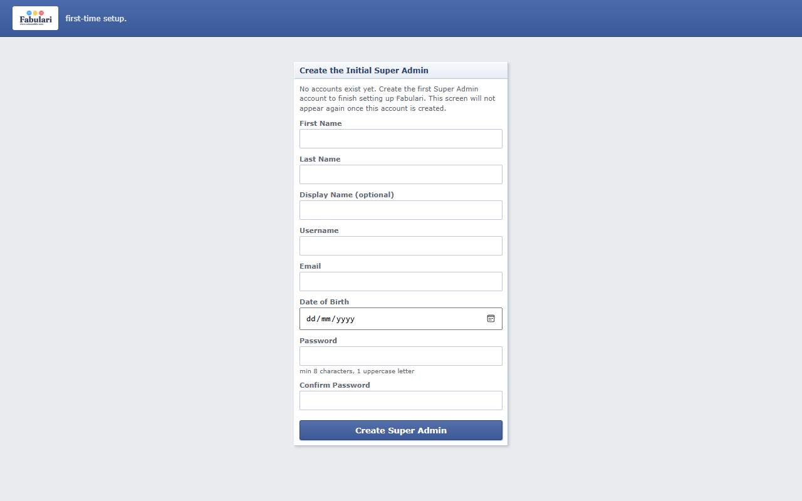

**Login and Register.**

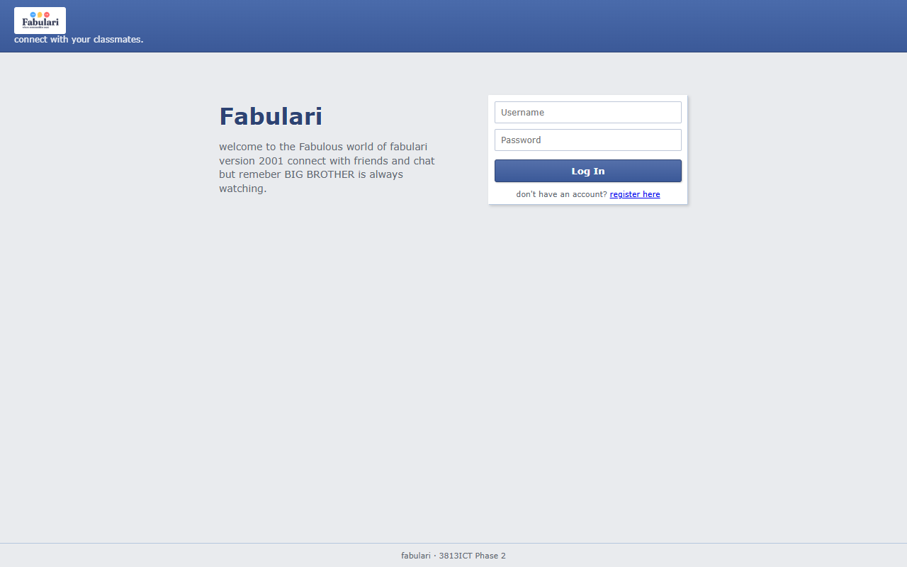

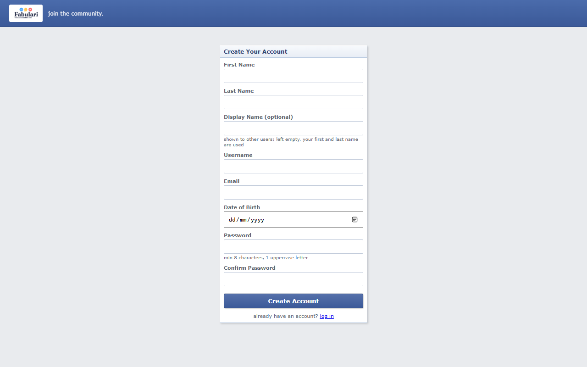

**A new user** has no groups yet and is pointed to Browse Groups.

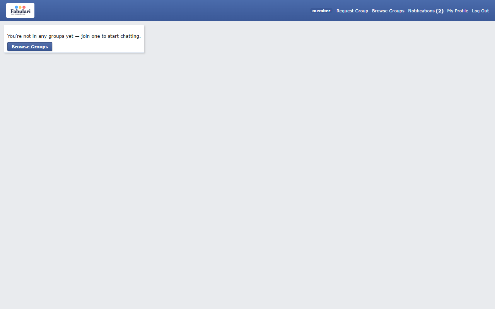

**Browse Groups.** Each group's button shows where the user stands. Here one request is pending, and the 18+ group is closed to this under-age user.

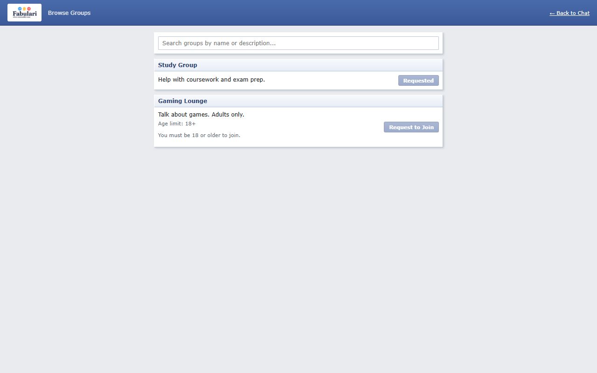

**Requesting a group,** with a minimum age.

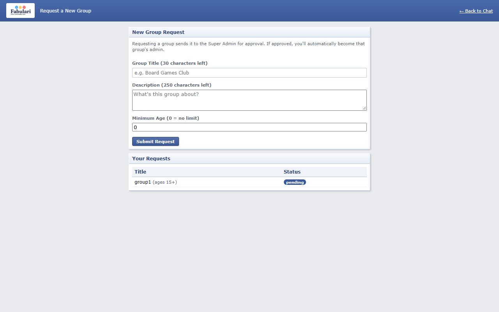

**Notifications** from the Super Admin. They cannot be replied to.

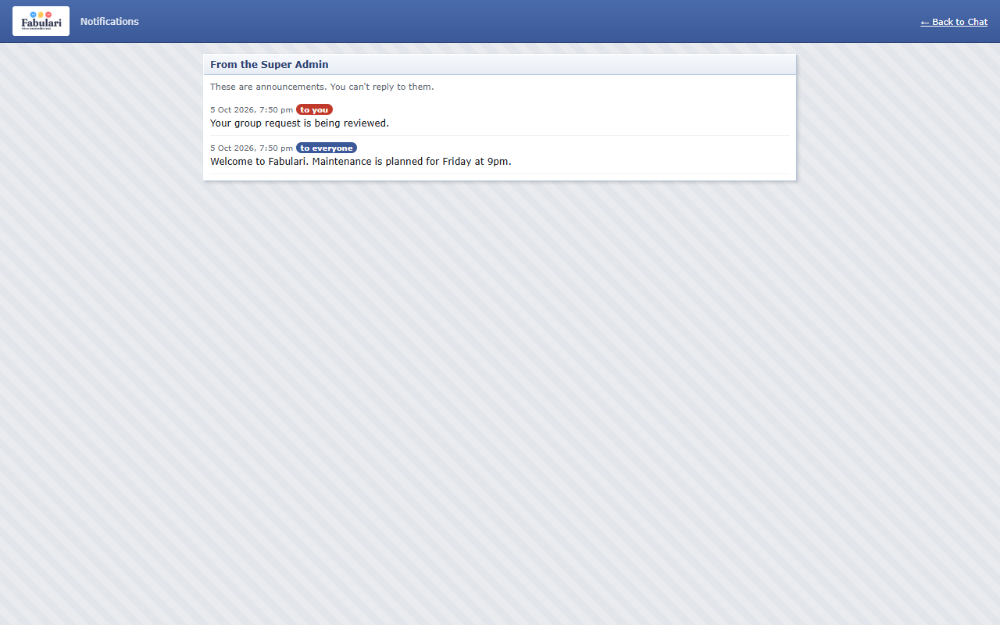

**Chat, as a member.** Other people's messages offer "block" and "report"; your own offer "delete". Online Now lists the group's members.

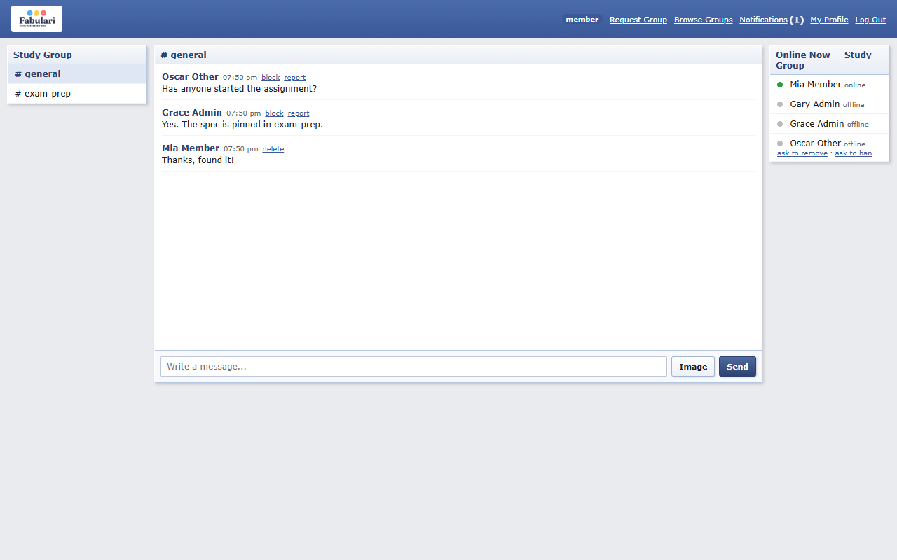

**Chat at tablet width.** The three columns stack.

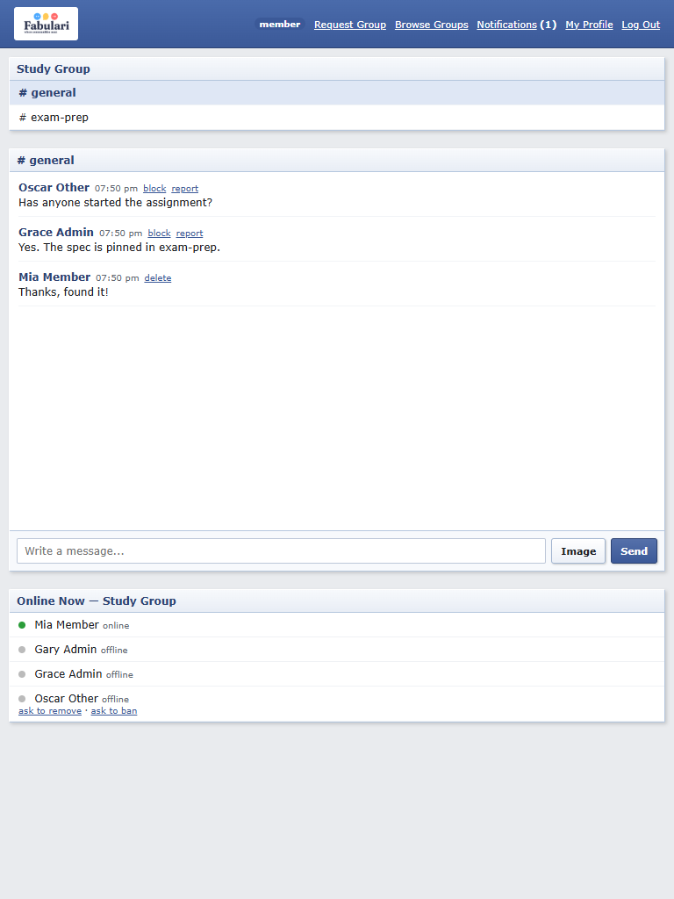

**Profile.** Picture, details, password, appearance, blocked users and account deletion.

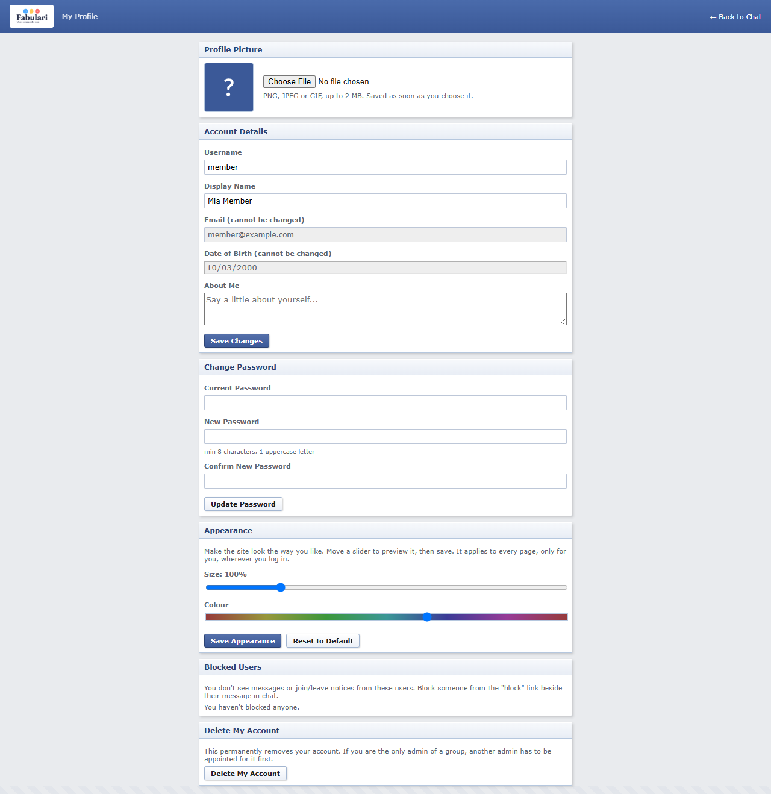

**Profile with a personal appearance.** The same page after moving the Size and Colour sliders.

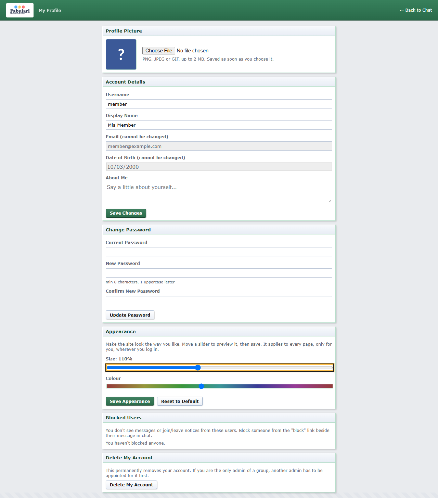

**Group Admin.** Join requests, remove and ban requests, reports, members, settings and channels for one group.

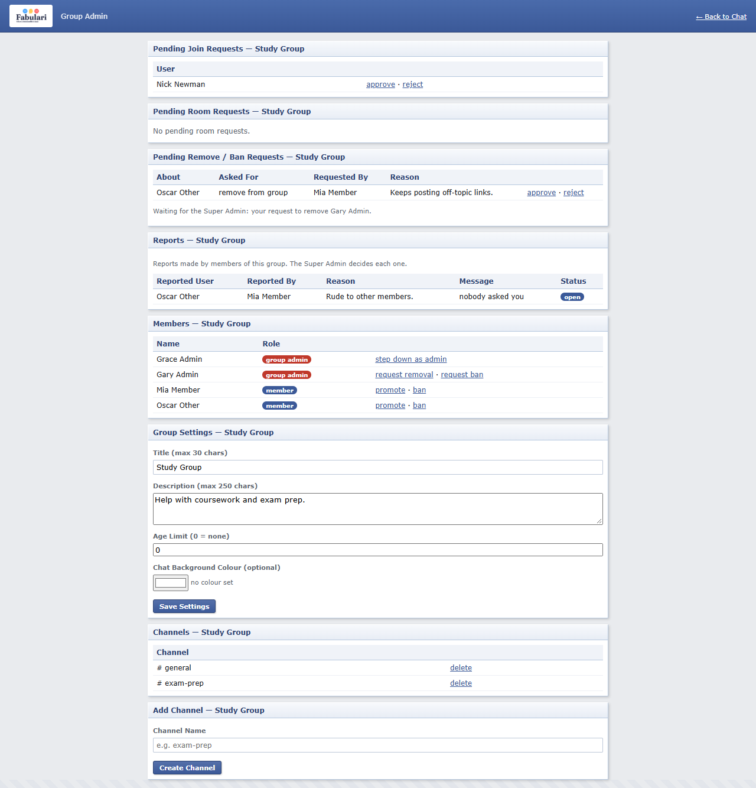

**Admin Panel.** Users, groups, group requests, notifications, admin removal requests and reports.

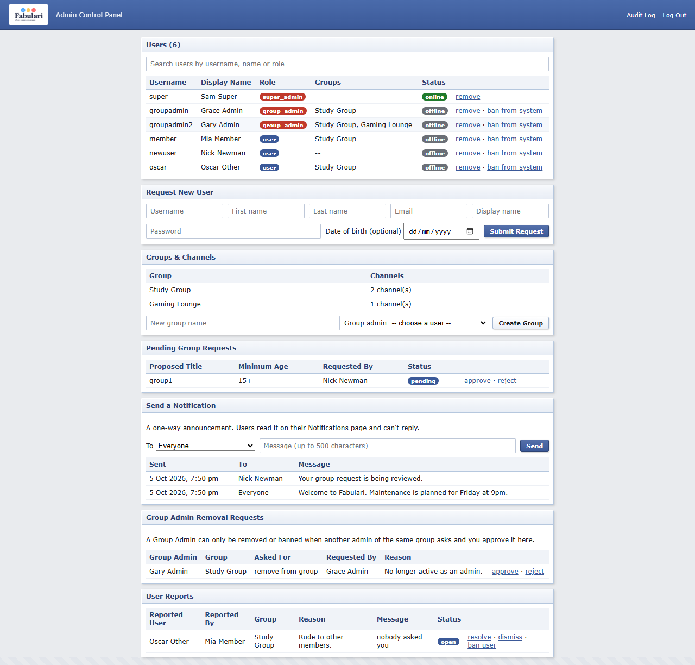

**Audit Log.** Every admin action, filterable by type and date.

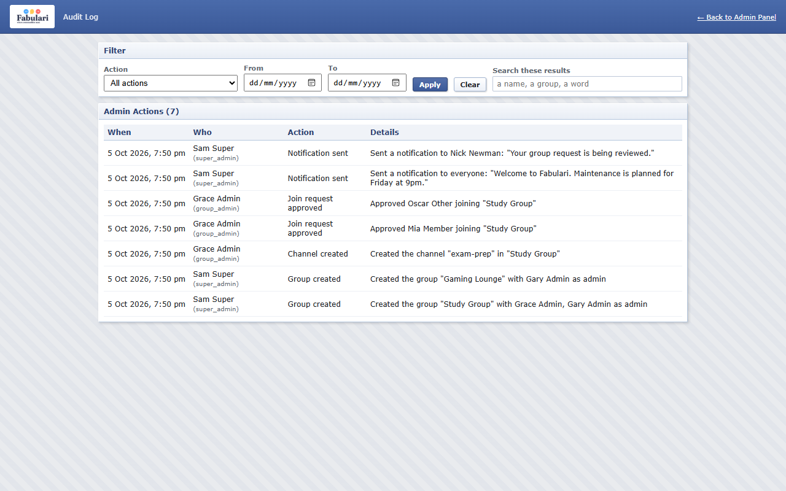

---

## 12. Known Limitations

- **There is no login token.** After login, the server is told who is calling by an id the browser sends; it cannot prove that id is genuine. The pages only offer each person the actions their role allows, and the server checks every rule about the data, but someone sending requests by hand could claim to be another user. The fix is a signed token issued at login and checked by the server on every request.
- **HTTPS is not set up.** The application runs over HTTP on `localhost`.
- **Uploaded images are public** to anyone who knows their address. The addresses are long and random, which makes them hard to guess but is not access control.
- **The date of birth is self-declared.** Age limits rest on what the user enters.
- **Blocking is applied by the blocker's browser.** The server still delivers the messages; the page hides them.
- **Who is online is held in the server's memory,** so it resets when the server restarts.
- **Long lists are paged in the browser** from the full list. That suits this size of system; thousands of rows would need the server to page.

---

## 13. Testing

### Method

There are three layers of automated tests, each run by one command.

| Layer | Tool | What it tests | How |
|---|---|---|---|
| Backend | Node's built-in test runner | Every REST route and socket event | Each test file starts the real server as a separate process and talks to it over HTTP and sockets, as the app does |
| Angular unit | Vitest, through `ng test` | Services, utilities, the interceptor and a component | Each piece is tested alone; the server and other services are replaced by stand-ins |
| End-to-end | Playwright, driving Microsoft Edge | The whole application | A real browser clicks through the real pages, against the real server |

**Tests never touch real data.** Each test server runs on its own port with its own database and its own folders, all removed afterwards. The normal application can stay running while the tests run.

### How to run

MongoDB must be running.

| Tests | Folder | Command | Expected |
|---|---|---|---|
| Backend | `angle/my-app/server` | `npm test` | 59 pass |
| Angular unit | `angle/my-app` | `npx ng test --watch=false` | 54 pass |
| End-to-end | `angle/my-app` | `npm run e2e` | 6 pass |
| Accessibility check | `angle/my-app` | `npm run check:a11y` | ALL CHECKS PASSED |

The end-to-end test starts its own server (port 3100) and its own copy of the app (port 4300); the first run takes a minute or two while the app builds. It uses the Microsoft Edge installed on the computer. Add `-- --headed` to watch it.

### Every automated test

There are 119 automated tests: 59 backend, 54 Angular unit and 6 end-to-end steps.

#### Backend tests

**Accounts** (`server/test/users.test.js`)

| # | Test |
|---|---|
| 1 | bootstrap creates the first Super Admin and then refuses to run again |
| 2 | a new account is always a plain user in no groups, whatever the client sends |
| 3 | the password is stored as a bcrypt hash and never sent back |
| 4 | login accepts the right password and refuses a wrong one |
| 5 | usernames are stored in lower case and must be unique whatever the capitals |
| 6 | registration is refused with a clear message when a field is invalid |
| 7 | a date of birth is optional, but when given it must be real |
| 8 | saving a profile lower-cases the username and refuses one that is taken |
| 9 | a changed password is hashed, works at login, and the old one stops working |
| 10 | a date of birth can be set once and not changed afterwards |
| 11 | an update with only unknown fields, or for an unknown user, is refused |
| 12 | appearance settings must be whole numbers inside the slider ranges |
| 13 | the About Me text is saved trimmed, and refused when too long |
| 14 | a system ban is saved, blocks login with 403, and can be lifted |
| 15 | a Super Admin cannot be banned, and the only Super Admin cannot be deleted |
| 16 | the only admin of a group cannot be deleted until another admin is appointed |
| 17 | an ordinary user can be deleted, and their pending join requests go with them |

**Groups, requests and channels** (`server/test/groups.test.js`)

| # | Test |
|---|---|
| 18 | a group must be created with at least one admin who is a real user |
| 19 | creating a group makes its admin a member and a Group Admin, and adds a general channel |
| 20 | group fields are validated: title, description, age limit and colour |
| 21 | group settings can be updated, but the last admin cannot be removed |
| 22 | a join request is refused for a banned user, an existing member or a duplicate |
| 23 | the age limit is enforced from the date of birth, to the day |
| 24 | approving a join request adds the user to the group |
| 25 | approval re-checks the rules: a user banned while waiting is rejected with the reason |
| 26 | a group request carries a minimum age, which must be a whole number |
| 27 | a channel needs a name and a real group |
| 28 | deleting a channel removes its messages, but a group keeps its last channel |

**Real-time chat** (`server/test/chat.test.js`)

| # | Test |
|---|---|
| 29 | a user who is not a member is refused, and nobody is told they joined |
| 30 | members exchange messages, and the sender id is the one the socket joined as |
| 31 | a socket that has not joined the channel cannot send into it |
| 32 | only the last 5 messages of a channel are kept, and history returns them oldest first |
| 33 | an empty message is dropped |
| 34 | a user can delete their own message, live for everyone, but not someone else's |
| 35 | bad payloads on any socket event do not crash the server |
| 36 | a user is online while at least one of their tabs is open |
| 37 | signing out marks the user offline even though the tab stays open |
| 38 | a member banned from the group is removed from the open channel straight away |
| 39 | closing a tab tells the channel the user left, exactly once |
| 40 | an unknown or malformed message id is ignored by delete |

**Moderation, notifications and the audit log** (`server/test/moderation.test.js`)

| # | Test |
|---|---|
| 41 | blocking is saved on the blocker's account and can be undone |
| 42 | a report needs a reason and a reporter who belongs to the group |
| 43 | the Super Admin decides a report once; group admins can list their group's reports |
| 44 | a member can ask for another member to be removed; approval removes without banning |
| 45 | approving a ban request removes the member and bans them from the group |
| 46 | a Group Admin cannot be banned directly, or at an ordinary member's request |
| 47 | another admin of the group can ask, and the Super Admin's approval removes them as admin |
| 48 | only the Super Admin can send a notification, to everyone or to one user |
| 49 | admin actions are written to the audit log with who did them |
| 50 | things ordinary users do are not logged as admin actions |
| 51 | the audit log can be filtered by action type and by date |

**Images** (`server/test/uploads.test.js`)

| # | Test |
|---|---|
| 52 | PNG, JPEG and GIF images are accepted and served back unchanged |
| 53 | other file types are refused with a clear message |
| 54 | a file that only claims to be an image is refused (its first bytes are checked) |
| 55 | an image over 2 MB is refused; one of exactly 2 MB is accepted |
| 56 | a chat message keeps an uploaded image but drops an outside address |
| 57 | an image file is deleted when its message drops out of the last 5 |
| 58 | deleting a message deletes its image file too |
| 59 | a profile picture is saved on the user, and replacing it deletes the old file |

#### Angular unit tests

**The root component** (`src/app/app.spec.ts`)

| # | Test |
|---|---|
| 1 | creates the app |
| 2 | contains the outlet that pages are drawn into |

**PagedList** (`src/app/utils/paged-list.spec.ts`)

| # | Test |
|---|---|
| 3 | shows the first page of 10 and counts the pages |
| 4 | moves forward and back a page |
| 5 | shows the shorter last page |
| 6 | does not go past the first or last page |
| 7 | filters by the search term, ignoring capitals and spaces around it |
| 8 | returns to the first page when a search is made |
| 9 | shows everything again when the search is cleared |
| 10 | has one empty page when nothing matches |
| 11 | follows the list when it is replaced |

**calculateAge** (`src/app/utils/date-of-birth.spec.ts`)

| # | Test |
|---|---|
| 12 | gives the age in whole years |
| 13 | counts a birthday that is today |
| 14 | does not count a birthday that is tomorrow |
| 15 | gives 0 for someone born today |
| 16 | gives null for a missing date |
| 17 | gives null for a date that is not a real calendar date |
| 18 | accepts the 29th of February in a leap year |
| 19 | gives null for the wrong format |
| 20 | gives null for a date in the future |
| 21 | gives null for a date too long ago to be real, such as year 0112 |

**AppearanceService** (`src/app/services/appearance.service.spec.ts`)

| # | Test |
|---|---|
| 22 | gives the standard look when nothing is stored |
| 23 | keeps values that are in range |
| 24 | replaces out-of-range or non-number values with the standard ones |
| 25 | fills in whichever value is missing |
| 26 | sets the colour variables for a chosen hue |
| 27 | removes the overrides at the standard hue, so the stylesheet colours are used |
| 28 | puts the standard look back when given nothing, as on logout |
| 29 | leaves the standard blue alone |
| 30 | darkens yellow, which is too bright for white text |
| 31 | never darkens by more than the shade has to give |

**UploadService** (`src/app/services/upload.service.spec.ts`)

| # | Test |
|---|---|
| 32 | accepts JPEG, PNG and GIF images |
| 33 | refuses other file types with a message |
| 34 | accepts an image of exactly 2 MB and refuses one a byte larger |
| 35 | sends the file to the upload endpoint as a form and returns the path |
| 36 | builds a full address from a stored path |

**AuthService** (`src/app/services/auth.service.spec.ts`)

| # | Test |
|---|---|
| 37 | has nobody logged in to begin with |
| 38 | remembers the user after login |
| 39 | never stores the password |
| 40 | applies the user's chosen colour at login and removes it at logout |
| 41 | tells the server who the tab belongs to at login, so the user shows as online |
| 42 | forgets the user at logout and tells the server the tab is signed out |

**The X-User-Id interceptor** (`src/app/interceptors/actor.interceptor.spec.ts`)

| # | Test |
|---|---|
| 43 | adds the X-User-Id header when someone is logged in |
| 44 | adds nothing when nobody is logged in |

**BrowseGroupsComponent** (`src/app/components/browse-groups/browse-groups.component.spec.ts`)

| # | Test |
|---|---|
| 45 | lets a user request a group they have no connection with |
| 46 | shows "Member" for a group the user is already in |
| 47 | shows "Requested" for a pending request read from the server |
| 48 | does not count someone else's request, or one already rejected |
| 49 | shows "Banned" for a group the user is banned from |
| 50 | blocks a user under the group's age limit, and says the age needed |
| 51 | blocks a user with no date of birth from an age-limited group only |
| 52 | sends a join request and then shows the group as requested |
| 53 | draws a panel for each group and disables the button where joining is not allowed |
| 54 | narrows the list when searching, by title or description |

#### End-to-end test

**One journey through the application, in order** (`e2e/chat.e2e.ts`)

| # | Test |
|---|---|
| 1 | an empty system asks for the first Super Admin to be created |
| 2 | a visitor registers and arrives in chat with no groups yet |
| 3 | a wrong password is refused with a message |
| 4 | the Super Admin creates a group and makes the new user its admin |
| 5 | the user sends a message in the group, sees it, and deletes it |
| 6 | a member cannot open the Super Admin's pages |
